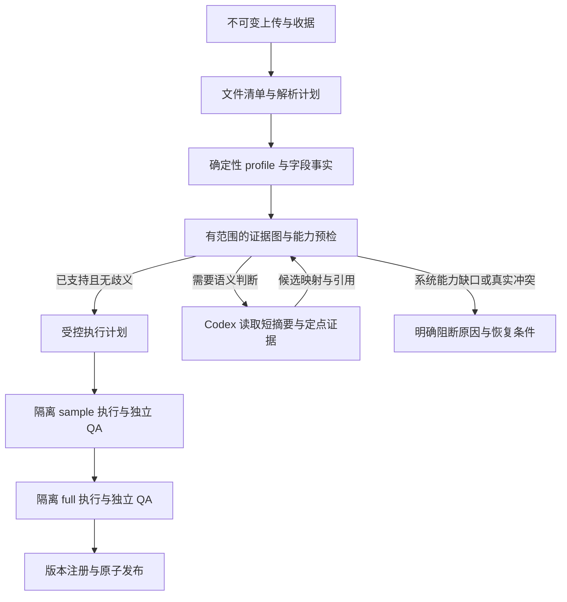

# ARSIA 通用数据接入能力：兼容性修复与低 token 开发任务书

日期：2026-10-01（Australia/Sydney）。交付对象：负责实施的 Codex。

本文是开发规格，不是已完成的修复或验收报告。本次仅审查代码、读取既有记录、运行无数据库写入的诊断，新增此文档。没有恢复上传、重启服务、运行导入模型、修改业务代码或发布数据。

## 1. 目标与边界

将 ARSIA 从“识别到某种表现形式才接受”改为“对支持的格式、来源和语义建立可复核的证据链”。优先解决 ACT 暴露的规则缺口，同时覆盖其他州常见的文件包装、元数据、坐标、日期、关联、版本更新问题。

general 的目标是：同样的数据换列顺序、JSON 属性顺序、文件名、压缩包装、合理文本编码或官方托管地址，不应改变其可接入性；真正的含义冲突仍应阻断相应能力。不能保证任意未知数据永远自动成功，必须能准确说明尚不支持什么、需要什么证据、下一步由系统还是用户处理。

本轮不更换 Codex harness，不增加第二个规划 Agent，不引入图数据库或向量数据库。沿用 Python、PostgreSQL、现有流式 readers、隔离 executor、Codex MCP bridge 和 Next.js。证据图先用有类型的 JSON 与普通索引实现。

实施约束：

- 工作目录为 `Workspace/ARSIA`，遵守根目录 AGENTS.md；已有大量未提交工作，先记录差异，不覆盖、重置或清理他人修改。
- 保护当前 NSW/VIC/QLD、主数据库、发布指针、原始 Resources 和用户的暂停任务。使用本次实施新建且有明确 marker 的测试数据库/产物目录；不复用当前手工上传数据库做破坏性测试。
- 默认先做离线 fixtures、纯函数测试和隔离集成测试。真实模型实验必须由明确启用的命令触发，不能被普通 pytest、页面加载或自动重试隐式调用。
- 不恢复 ACT 历史 needs_input 任务，不更改其 policy/hash。需要验证时创建新测试任务，保留历史失败事实。用户另行要求恢复时，走显式迁移/新 attempt 流程。
- 保留来源证据哈希、原值、逐行溯源、样本/full QA、版本注册、原子发布、取消与恢复边界。
- 不通过删掉 geography、填零、修造主键、丢弃异常行、换下载数据替代上传文件等方式取得“成功”。

## 2. 本次审查依据与证据等级

审查入口：`pipeline/arsia_pipeline/` 的 intakereaders、intake_tools、public_sources、evidence_grounding、geography_review、casualty_review、canonical、trusted_qa、agent、agent_progress、contract_diagnostics、context_memory、codex_bridge、codex_runtime、source_identity、registry、update_compatibility、publication、processing、agent_status；相应 tests；AUTONOMOUS_CONTRACT、CODEX_RUNTIME 及验证文档；前端 Imports 状态类型和展示。

标记含义：**R** 为实际复现/运行记录；**C** 为代码已确认的机制或限制，尚未完成真实数据回归；**H** 为应补测的风险场景，不能写成已证实的数据错误。

### 2.1 ACT 基线（R）

任务 `5a216839-193a-4309-8fe0-25be1bf9daeb`，session `64d2e7ff-4f27-4de0-9e88-3c31211ce053`。审查时仍为 needs_input。

输入：`/Users/zhengpeixian/Downloads/ACT_Road_Crash_Data_20261001.csv`，SHA256 `950eb319cc566d375f7fbe993760cbc8245f4f1d51b93b5a0baa720eb4cebb41`。

- 76,657 行，主键唯一，日期/时间/经纬度可解析，坐标无缺失或全球范围越界。
- 4,629 行 Location 与独立坐标列存在舍入差异，最大单轴差 5e-12 度。
- 14 行 suburb 缺失；28,786 行方向缺失。Fatal 105、Injury 6,576、Property damage only 69,976，均为事故数。
- 官方 RDF 按 crash_id 排序读取 100 行，与上传匹配，比较容差 1e-7 度。这不是官方全表逐行认证，也不是行政边界空间验收。
- 三次 sample 执行成功，三次 validate_candidate 均因 CRS_UNGROUNDED 未通过；一次 full 请求被 sample gate 拒绝，未实际运行 full。
- 51 次模型请求、141 次记录的工具动作、2 次修订。累计 input 2,903,312，output 26,653，total 2,929,965；cached input 2,299,806 已包含在 input 中，不能再次相加。已记录请求的 usage 缺失数为 0。
- 工具包含 60 次 Codex shell 动作、29 次 fetch、21 次 read_document、6 次 discovery、7 次 profiling。指定调查工具没有完全相同参数的重复调用；7 次 profiling 涉及不同文件/导出。因此不能把成本都归因于完全重复请求。

证据在 `artifacts/act-crs-diagnosis-20261001/`：README、csv-check.json、official-sample.rdf、official-sample-check.json、rule-reproduction.json。基线只能用于定位和对比，不得重标为已准入。

### 2.2 已定位缺口

| ID / 级别 | 位置与现状 | 影响与开发要求 |
|---|---|---|
| F01 R | `trusted_qa._proof` 要求 `.gov.au` 和 final_host_official | W3C 等词汇定义、官方授权的外部托管内容无法成为对应类型证据；改为分角色、分范围的来源授权 |
| F02 R | `geography_review.coordinate_evidence` 支持 EPSG 文本/ArcGIS geometry 元数据，不解析 RDF 语义 | 纳入 W3C 文档后仍失败；需要真正的词汇与字段绑定，不是加域名白名单 |
| F03 R | `intakereaders._json_layout` 在遇到 features 数组时提前返回 | 同一 FeatureCollection 的 type 放在 features 后会误判 ArcGIS；ArcGIS spatialReference 放在 features 后会丢失。已用内存输入复现 |
| F04 C | reader 返回 geojson_default_crs，但 grounding 的结构化坐标准入主要面向 ArcGIS | reader 支持不等于整链支持；每种能力须贯通读取、合同、QA、发布、查询 |
| F05 C | `_proof` 保存经抽取 text，未将已验真 raw bytes 交给 grounding；HTML 文本抽取去掉标签 | 真实超链接、结构化元数据、namespace 等信息可能丢失；结构化解析应基于原始收据字节 |
| F06 C | `_links` 只认少数 JSON 键；connected_documents 可经双向普通链接形成连通关系 | 既可能漏识别，也可能将不应授权的引用扩大为权威；必须区分 typed directed edges、数据集和字段范围 |
| F07 C | `source_identity.url_identity` 再次要求 gov.au；provider 身份逻辑与 grounding 各自归一化 URL | 前面通过、注册才失败的风险；托管别名、迁移、查询范围必须用统一身份服务 |
| F08 C | `_csv_spec` 非 UTF-8 无 BOM 即要求出版社编码；header 默认第一行；少量 dialect 参数 | 一部分可机械验证的格式问题过早转为用户问题；新增可证明的解析计划与等价候选处理 |
| F09 C | workbook 首行表头；公式拒绝；JSON header 仅看前 100 条但迭代保留 late fields | 标题行、多表区、公式缓存、晚出现字段等需明确能力及诊断，不能承诺当前已支持 |
| F10 C | `validate_contract` 按资源一一分配、最多一个 crash role；project 每原行一投影 | 多年同构文件、lookup、宽表/汇总表等不是“模型多写 Python”就能解决；需受控表计划/语义算子 |
| F11 C | `casualty_review` 用狭窄英文正则判断 complete；partial/false 目前要求澄清 | 正当的不完整子表也容易长期阻断；需结构化范围声明和适用性判定 |
| F12 C | evidence grounding 主要核对字段存在、关联文档和精确引用 | 不能证明每个计数公式、类别含义、更新模式均正确；不要把来源真实误当语义充分 |
| F13 C | canonical 转换使用 always_xy；未见显式 operation/grid/ballpark 精度策略 | 其他投影或缺 grid 时可运行不等于符合质量要求；新增可重放的变换计划 |
| F14 C | errors 将传输、预算、证据等汇入 NeedsInput；progress 以新文档 hash/引用片段算进展 | 新网页或换格式可延长调查，未必解决同一阻断；区分错误类别并按问题跟踪进展 |
| F15 C | `TaskBridge.tool` 通常返回最多约 48KB 完整结果，随后仍可 shell 读取；context_memory 主要用于旧循环 | Codex 路径需独立接入 compact facts；单改旧 memory 不会达到目标 |
| F16 C | TRUSTED_FILES 是固定清单，registry/update 只覆盖部分身份/版本语义 | 新增准入依赖必须纳入版本；日期、CRS、计数口径变动需显式历史兼容判定 |
| F17 C | `agent_status` 的 qa_checks 只统计部分结果结构 | 3 次失败 QA 可显示 0；拆分尝试、成功、失败与阻断原因 |
| F18 H | SDK project 和 trusted replay 共用 canonical.project | 能防 adapter 篡改，不能自动发现共享库的共同错误；需独立预期/来源 oracle |

已存在的优势必须保留：不可变输入与收据、DNS 固定/重定向检查、ZIP 路径限制、流式读取、磁盘 profile、完整键和外键检查、原值扩展、样本与全量分离、候选哈希、事务发布、取消/恢复、已发布数据隔离。不要重写这些已工作的边界。

## 3. 设计：将发现、解释、验证分离



AI 负责解释不熟悉的语义、提出映射和调查下一步；常规格式检测、证据连接、计数、坐标标准解释、缓存、门禁和发布都由程序负责。任何 AI 置信度或自由文本“已确认”均不构成准入凭据。

新增模块名是建议，可合并相邻职责，但对外契约和测试必须保留：

| 模块 | 职责 |
|---|---|
| `evidence_types.py` / `evidence_graph.py` | 类型、来源角色、定向边、claim 适用范围、冲突和 proof DAG |
| `metadata_extractors.py` | 原始 JSON/XML/HTML/CSVW 的无模型事实提取与精确 locator |
| `capability_preflight.py` | 合同提议前后检查 reader→projection→QA→query 是否支持，返回最小未解决项 |
| `parser_plan.py` / `table_plan.py` | 可审计解析参数、表区域、同构分片、辅助表分类、行守恒 |
| `semantic_operators.py` / `transform_plan.py` | 有类型的有限算子、坐标操作及不可变依赖 |
| `evidence_cache.py` | 版本化事实/profile缓存、重验证、负缓存和受控容量 |
| `issue_tracker.py` | 问题签名、证据变化、无进展检测和恢复条件 |
| `agent_facts.py` | Codex 的短事实包、差量、定点检索索引 |

不允许用户上传自定义 plugin 直接进入可信解析/QA。新 provider extractor 是经过代码评审和测试的程序；模型生成的 adapter 始终留在隔离区。

## 4. P0：统一证据模型，修复 ACT 与顺序依赖

### 4.1 证据类型与授权

将“能下载”“来自谁”“能证明什么”拆开。URL 网络检查与证据权限检查是不同层，不得因为允许 W3C 而放松 SSRF、TLS、重定向、大小和超时限制。

文档角色至少包括：publisher_dataset、publisher_dictionary、delegated_resource、normative_vocabulary、format_specification、uploaded_document、discovery_candidate。角色由 host 提取和验证，不接受模型自报。

授权规则：

1. 发布者身份从政府数据集页/目录中的特定 dataset/resource 记录建立；共享 gov.au 主机不足以证明是同一数据集。
2. 外部托管（S3/CDN、ArcGIS Online、出版社其他域名）只接受发布者对特定 resource 的明确分发/元数据委托，记录完整边链；普通页脚、导航、广告链接不构成授权。
3. W3C、RFC Editor、OGC 等词汇/格式定义仅解释其精确 namespace、media type 或指定标准版本。不要赋予整个网站“任意数据集可信”的资格。
4. 外部文档回链到政府网站，不能倒推出政府授权；禁止双向无类型链接扩散信任。
5. 用户上传的文档可用于发现和候选解释。与官方收据字节一致，或通过已验证的出版者资源绑定后才能提升对应权限；用户说“官方”不能单独提升。
6. 证据冲突必须保留。新日期不自动覆盖旧定义；应先确定适用资源、版本、字段和时间范围。

建议 host 产出的最小记录：

```json
{
  "proof_version": "evidence-v1",
  "claim_id": "claim:<stable-hash>",
  "predicate": "coordinate_reference",
  "subject": {
    "dataset_identity": "provider-specific-identity",
    "resource_identity": "resource-id",
    "field_paths": ["Location.longitude", "Location.latitude"],
    "scope": {"kind": "resource"}
  },
  "value": {"datum": "WGS84", "axis_order": ["longitude", "latitude"], "units": ["degree", "degree"]},
  "provenance": [{"document_sha256": "...", "locator": {"kind": "xml-expanded-name", "value": "..."}}],
  "derivation": {"rule_id": "rdf-basic-geo-v1", "input_claim_ids": ["..."]},
  "status": "supported"
}
```

claim 的派生和 supported 状态只能由 host 写入。模型仅提供 proposal，里面的引用重新通过字节 hash、locator、适用范围检查。将 source identity、resource identity、representation URL、fetch observation 分开；同一 Socrata ID 的 `$where`、`$select`、`$limit` 不能被当作同一完整下载范围。HTTP namespace IRI 是语义标识；实际抓取可使用受控 HTTPS 跳转，但不能全局把所有 http/https、www、大小写、query 任意合并。

原始内容 hash、抽取器版本、抽取文本 hash、JSON Pointer/XML expanded name/PDF 页及文字定位都保留。JSON schema/字段证据优先用结构化 locator，减少模型复制易错长引文；自由文本证据仍保留精确引文检查。原文不可被“清洗后文本”替代。

### 4.2 RDF、GeoJSON、ArcGIS、CRS

RDF 初版做安全的、明确范围的 RDF/XML 提取器即可，不要求通用推理引擎。使用已有 defusedxml，禁止 DTD/实体解析和自动网络解引用。按完整 namespace URI + local name 匹配，prefix 可以不同。仅发现 `xmlns:geo` 不足够，必须在目标资源/字段实际使用 geo:lat/geo:long，建立到 CSV 字段的绑定。

ACT 验证链：官方 Socrata identity → 字段别名 LONGITUDE/x、LATITUDE/y、Location → 同一资源 RDF 中 Location 的 WGS84 属性 → 上传中 Location 与 x/y 的一致性。已有 100 行比对用于诊断；实施时用受控全文件列比较证明上传内部对应，官方抽样覆盖不同年份/非空类别而非只前 100 行。抽样证明的范围必须写清，不能声称全表官方逐条认证。

GeoJSON：

- 整个顶层 envelope 的识别不能依赖成员顺序；可做低内存两遍扫描，不把全部 features 放入内存。
- 对确认按 RFC 7946 解释的几何使用 OGC:CRS84 的 longitude,latitude 顺序；记录该解释依据和协议版本。检查 null geometry、2D/3D、Point/非 Point、有限数字、范围和字段绑定。
- 有旧版 `crs`、冲突的坐标声明或不符合地理范围的值时，进入 legacy/冲突分支，不无条件套默认。标准语义只适用于 geometry，不自动适用于 properties 中任意 x/y。
- Polygon/Line/MultiPoint 等保留原几何；当前点地图不能擅自取质心、第一点或多行展开。报告能力不支持；后续 polygon capability 单独扩展。

ArcGIS：

- 识别元数据在 features 前后、顶层或几何内的位置；区分服务 CRS 与 query outSR 的响应 CRS。
- 保留 WKID 的 authority、latestWkid、WKT；数字 102100 等不自动标为 EPSG。
- geometry CRS 不能套到独立测站、局部网格等属性坐标。分页继续保留当前 IDs 前后校验；不得把 count 一致解释为事务快照。

CRS 统一使用 pyproj 验证 EPSG/ESRI/OGC URN/WKT 等已支持表达，别名需权威定义。GDA94、GDA2020、WGS84 不按字符串相近当作相同。always_xy 是执行轴约定，不是证明原始轴序的证据。

产生 `TransformPlan`：source CRS、source axis/units、target CRS、operation 标识/描述、area of use、accuracy、grid 名称/hash、PROJ/pyproj/database/image 版本、ballpark 状态。根据产品所需精度判断可用性；未知 accuracy 不是 0。缺必需 grid 应明确 `TRANSFORM_RESOURCE_MISSING`；由宿主受控准备新镜像，不让 adapter 下载或静默降级。普通示意地图也必须披露可证明的精度，不制造毫米级准确性承诺。

保留现有 canonical 8 位小数与 raw 精确值。仅在判断两个源坐标表示是否相同的证据环节使用单位明确、可解释的容差；不得放宽 canonical 全行对账。5e-12 度的舍入差异和几十米的 datum/轴序错误必须被不同对待。

### 4.3 预检早于模型反复调查和 full 执行

增加纯查询工具 `inspect_capabilities` 和 `preflight_contract`。在 inspect_bundle 后和合同提议后运行确定性预检，返回：已支持能力、所用证据、冲突、缺失字段、系统尚未实现的证据类型、最小下一步。无需要样本运行的错误应在启动容器前发现。

必须区分：

| blocker.kind | 示例 | 行为 |
|---|---|---|
| `format_ambiguity` | 两种编码解析成不同文字、歧义日期顺序 | 程序先缩小候选；确有多义才问具体问题 |
| `evidence_missing` | 确实缺少数据字典 | 定点发现或用户补资料 |
| `evidence_conflict` | 同一版本同一字段有互斥 CRS | 保存双方范围，不靠投票放行 |
| `unsupported_capability` | 已找到 RDF 证据但当前 extractor 不支持 | 停止重复查找；说明需系统修复，不要求用户重复证明 |
| `source_quality_block` | 重复完整主键、真实非法计数、完整关联孤儿 | 定位行/字段与统计，保留候选与原文件 |
| `environment_dependency` | grid 缺失、不可用 reader 依赖 | 系统维护动作，不让数据 Agent 修改可信环境 |
| `transient_transport` | 429/503、临时 DNS | 按现有授权和有界策略处理，不重跑成功的数据步骤 |
| `budget_exhausted` / `cancelled` | 预算用尽/用户取消 | checkpoint，禁止自动扩大或复位预算 |

第一阶段可以保留外部 job.status=needs_input，以 `blocker.kind`、`responsible_party`、`resumable_when` 和明确 UI 文案区分，避免一次性破坏状态机。前端不得给 unsupported_capability 展示“请填写缺失定义即可解决”。

## 5. P1：解析、资源分配和字段语义的通用能力

### 5.1 ParserPlan

一个 ParserPlan 同时供 profile、sandbox reader、trusted QA 使用，包含 format、encoding、dialect、table/sheet、header region、字段路径、日期单元格规则、计划版本与输入 hash；任何调整必须生成新版本和重新 QA。

- CSV：BOM、UTF-8/UTF-16、cp1252 等受控候选；strict decode、必要的字节回编码/逻辑等价检查、全表宽度及引号验证。候选解码为完全相同文字可选一个并记录等价性；不同文字不能仅靠 charset confidence 猜。无需对所有机械编码选择强制索取官方声明。
- 允许明确 quote/escape/doublequote、分隔符、前置说明行、headerRowCount、注释行与空行策略。依据官方 dialect 或可验证且唯一的结构决定；识别不唯一时询问。不得以 skipRows 隐藏不合格数据。
- 物理表头与逻辑字段 ID 分开：保留原名、列序、空格/Unicode/大小写；规范化仅作检索键。规范化碰撞时使用位置定位并要求明确映射，不能覆盖重复列。
- Excel：识别说明页、真正表区域、多行/合并表头、隐藏 sheet、1900/1904 epoch 和缓存错误；保留 sheet/row/column locator。默认不执行公式或宏。cached formula values 必须有明确模式、缓存来源和完整性限制；第一阶段没有可靠能力就清楚标 unsupported，不伪装成坏数据。
- JSON：属性顺序无关；重复键、非有限值仍拒绝。profile 发现前 100 条之后的新字段并合并 schema；字段 absent 与 explicit null 分开统计。嵌套路径使用 JSON Pointer 或明确路径数组，区分字段名中的点和真正嵌套。
- JSONL：一条/多条、BOM、空白行处理有显式策略；一个 JSON object 也可作为文档，不盲目当事实表。不要让 parser hints 绕过对真实 envelope 的识别。
- 首期支持类型限定为现有 CSV/XLSX/XLS/ZIP/JSON/JSONL/GeoJSON 与文档 PDF/HTML/TXT/MD；RDF 首先用于证据。Parquet、GeoPackage、Shapefile、压缩 CSV、KML、多层 ZIP、扫描 PDF OCR 列为扩展能力，未实现前必须提供准确诊断，不自动安装任意依赖。

### 5.2 TablePlan、分片和辅助表

给每个 archive member、sheet、table region 明确用途：fact、lookup、dictionary、metadata、container、unsupported。普通附件分类需可检查的依据；不要用字段名像 name/description 就把真实事实表忽略。ZIP 中的目录包装、同名不同路径、README、操作系统附带项都保留 manifest 和分类原因；安全限制继续有效。

增加一个 logical resource 下的多个物理 partitions：同构年度 CSV/XLSX 可以 union 为一个 crash resource。每行 lineage 使用物理文件 hash + table id + row locator，不能仅用 csv:1；原身份维持 publisher key，不把文件名加入业务键掩盖重复。重复范围必须明确对账，不能简单加总。

Lookup 只允许受控 join：证明 key 唯一性、字段用途和关联基数；若一对多导致行膨胀，必须拒绝或显式建立另一粒度。join unmatched、重复、覆盖率要报告。聚合 observations 与 crash 微观记录同时上传时分别建逻辑数据集/核对视图，不将两者合并计数。

年度文件 schema drift（列名、类型、分类、CRS 或计数范围变化）允许分片有各自受证据支持的 mapping，再投影到同一兼容语义；不允许同一 logical field 在一个版本里无记录地变义。

### 5.3 有限、可重放的语义算子

现有“生成任意 Python”不能绕过 trusted replay 只理解固定 project 的事实。需要新增操作时，同时扩展合同、SDK、可信解释器及测试；没有对应可信算子的代码应早期报告能力缺口。

首期允许的有限算子：field_path、明确 category_map、受证据支持的 nullable integer/decimal、日期/时间解析、同构 union、受约束 lookup、非重叠字段求和、单位换算和显式宽转长 observations。算子组合使用有类型的 DAG/JSON，不支持 eval 或由模型自定义可信函数。

每个算子定义输入类型、输出类型、空值规则、依赖字段、是否改变行数、lineage 规则和需要的 claim。生成 adapter 可调用已批准计划，但不能修改可信解释器。样本和全量对其逐条重放。

字段处理要求：

- IDs 默认保持文本和前导零；数字化/去空格/Unicode 规范化如改变标识必须显式声明，不能把 001 与 1 自动合并。复合键顺序、跨年度唯一范围、匿名 ID 更新必须有证据。
- 日期区分 occurrence/report/publication 日期、日/月/年精度、财年区间、本地 wall time 与 instant；Excel serial、ISO offset、epoch 秒/毫秒都保留原值。DST 不存在/重复时刻不能用主机时区猜。区间型观察暂不支持时报告能力缺口。
- 数值分开单位、千位符、小数符、百分比、科学计数、抑制值 `<5`、`..`、`N/A`、`-1`；缺失/抑制/不可用不能变成零。null_values 优先字段级，不把全局 `0` 误作用到事故数或主键。
- Severity 保留源分类及年份版本；fatal crash、fatal person、injury crash、casualty person 不混用。新增类别或未登记类别必须被 profile 及语义检查发现，不能自动并为其他或直接令 false。
- `sum_fields` 必须证明分项不重叠、范围和单位相同；“字段存在”不能证明可以相加。定义未知时对应指标 unknown，不能输出看似精确的值。
- casualty scope 明确 population、过滤条件、时间范围、是否 complete 和对应 parent resource；仅在子表范围与源总数定义一致时要求 equality。partial 子表可提供自己的记录数与覆盖率，但不能冒充完整 casualty total；保留真实未知。
- 关系检查对整个 bundle 做，不能让前 1000 行样本中的缺父记录变成全量孤儿结论。孤儿是否属于官方范围外必须有声明和审计，禁止补造 parent。

### 5.4 质量告警与准入边界

将 row/field/dataset/capability 四种 scope 分开。suburb/方向等非关键缺失可产生 warning；不合格必需主键、核心计数和未说明的丢行仍阻断。

允许合法、已解释的能力限制，例如来源确实无伤亡人数；保留事故数和其他已验证能力。不得用“地图 optional”静默删除当前已有支持证据的 geography。若实现部分能力发布，必须是独立、版本化的产品策略和可见用户选择；本轮 ACT 验收仍要求验证坐标，不能靠关闭地图过关。

官方描述的覆盖年份过时，与原始记录日期合法不等价于数据损坏。分别保留 declared coverage、observed coverage、complete coverage claim；后者影响 snapshot/partition 删除权限，不能从 min/max 日期推定全量。

## 6. P1：减少模型往返和 token 的具体实现

### 6.1 先确定性调查，再按需调用模型

首次 inspect_bundle 完成结构信息、唯一 parser 候选、full profile 摘要、provider metadata endpoint 候选、适用 reader/QA capability 列表。重计算能在一个受控工具内部批量完成，不要求模型逐步发指令。

对标准元数据、已验证格式含义、数值统计与文档定位使用程序；AI 只处理尚未确定的语义。官方标准定义可作为带 hash/version 的 reviewed rule catalog 放入项目，不在每次上传时让模型重新寻找 W3C/RFC 定义。catalog 必须精确到规范/词汇，不是 ACT 的特殊规则。

优先 metadata、schema、HEAD/受限 GET、明确 key 抽样；仅为证明 CRS 不应反复下载数个完整数据导出。Socrata/CKAN/ArcGIS 的可预测只读端点做 provider extractor，而非州名条件分支。fetch 策略保留认证失败和资源上限，不绕过访问限制。

### 6.2 缓存的键与失效

| 内容 | 缓存键至少包括 | 复用边界 |
|---|---|---|
| table/profile | 输入 hash、ParserPlan hash、reader/profile 版本、完整/抽样范围 | complete 不可被样本覆盖；新列、参数、算子升级失效 |
| 文档事实 | 原响应 hash、extractor/rule 版本、定位与范围 | 原收据保留；解析规则变化重提取 |
| 网络内容 | 完整规范化 URL、method、representation、ETag/Last-Modified | 政府元数据变化做条件请求；304 必须引用已保存 body，离线旧证据显示时效 |
| claim / preflight | source/resource identity、claim 输入 hash、policy/version | 新冲突、源版本和适用范围改变失效 |
| adapter 模板 | 已准入 source identity、schema+语义签名、算子依赖 | 仅候选复用，重新校验实际文件，不能复用旧 attempt 的发布准入 |
| 失败/不支持 | blocker signature、依赖版本、来源响应状态、TTL | 404 与 429 区别；更新依赖/新证据可重新尝试，禁止永久负缓存 |

缓存记录 cache_hit、origin_step、verified_at、bytes avoided。相同 bytes 的 metadata fact 可以去重；数据集权限与委托边不能仅按 hash 跨来源继承。profile 统计含潜在敏感属性，按实例/授权范围隔离，不建立全用户共享查询入口。

### 6.3 Codex 实际路径的上下文

修改 TaskBridge 的 compact result projection，而不是只修改 legacy context_memory。

- 默认工具结果返回 `status`、少量事实、blocker、`proof_refs`、`result_file`、`content_hash`、可用 retrieval selector；长 profile/原文只保存在证据文件。
- 建议常规 MCP 摘要目标 ≤6 KiB，复杂诊断 ≤12 KiB；这是工程目标，不截断必要事实来强行达标。支持分页/精确字段或 JSON path/claim 搜索，明确 omitted 内容。
- 新建 `evidence/facts.json`、`evidence/index.json`、`evidence/issues.json`：只写 host 派生事实、来源和当前未解决项。模型可定点读取完整文档。每次更新写原子文件并有版本/hash。
- `read_evidence`/`read_claims` 返回所需片段与 locator，避免先 MCP 输出完整结果，再 shell cat 一次。需要完整上下文仍允许读，不禁止诊断。
- 将 token 开销分成 provider input、cached input、output、reasoning（若提供）、compact 与 unknown receipt；cached input 是 input 子集。重试、取消和中断仍记账；不能把重复响应 id/stream receipt 算两次。
- 本轮不引入新的小模型“校验官”。Imports 保留现有 Sol/high；普通问答 Terra 路由不变。先减少必须经过模型的步骤，避免改变硬编码多层模型策略导致新兼容性问题。

### 6.4 按问题而非网页数量判断进展

定义问题签名：`code + subject/source/resource/field + normalized conflicting values + required evidence type + policy version`。记录该问题的新适用证据、冲突减少、候选减少、QA 条件解除，而不是新 URL/hash 就重置无进展计数。

对同一个未变化问题最多允许少量不同策略探索（建议默认 3 次作为实验起点），然后输出具体诊断。新证据真正改变该问题的可解性时才恢复该局部额度；不可因换引文、换输出文件名或重写无关代码无限续命。

识别为 unsupported_capability 时立即停止对相同证据的模型调查，保存可复现 case；不是把所有证据未找到都提前定为“不支持”。发现 429/503 属传输问题，不能转为修改 source contract。

绝不通过提高 120 model / 200 tools 等现有上限掩盖循环，也不以更低任意硬上限替代正确诊断。Codex 原生自动 retry 当前禁用，保持单一重试所有者，不额外叠一层 retry harness。

## 7. P1：版本、准入、更新和可观测性

- 新证据/解析/算子模块和规则 catalog 加入 trusted implementation dependency manifest。包括 grid、CRS 数据库、镜像 digest；不可仅更新 POLICY 字符串。把 reader/SDK 改动打进新 executor image，host 与 sandbox 必须一致。
- 不复用旧 worker 已加载代码的 QA；代码 hash 改变后按维护窗口切换新测试 worker。独立验证新版本，不重写历史 admission。
- 将 execution identity（原始文件/执行版本）、semantic identity（业务含义）、representation identity（列顺序/包装）分开。元数据浏览量变化不应制造新语义版本，真实定义/字典变化必须使对应准入失效。
- 注册阶段使用同一 source identity 服务；前置诊断需检查可注册性，不让任务跑完全量才发现外部官方托管身份不被接受。
- retained-history update 不仅检查 key/roles/relations，也比较时间/CRS/类别/计数口径/范围等兼容签名。已证明等价的字段别名/表现变化可复用；定义改变应要求重算受影响历史或发布独立语义版本，不能静默混合。
- snapshot 删除权限必须由完整快照证据建立；partition 删除限定已证明分区；incremental 不把未出现记录当删除。旧记录更正与真正 no_change 分别检测。
- UI 显示 current phase、last meaningful progress、blocker.kind、负责方、恢复条件，以及 sample/full 各自 attempted/passed/failed。区分“程序执行成功”“样本 QA 通过”“已发布”。
- 阶段收据包括 start/end/wall、CPU（可得时）、队列等待、网络/模型/QA/发布时间。并行步骤可累计超出总 wall，报告明确区分，不简单求和冒充总耗时。
- 每个 blocked case 产出脱敏的可重放诊断包：最小结构样本/原文件引用与 hash、相关文档收据、ParserPlan、claim graph、版本、预期与实际。禁止将 provider key、DB DSN、原始个人记录写入模型或公开报告。

## 8. 回归矩阵：通过、告警、阻断都要有预期

下表是必测场景，不表示当前已通过。P0/P1 是本轮交付范围；P2 是后续能力，当前至少要正确报告不支持。每个正例配一个接近的反例，不能只增“通过”测试。

| 编号 | 范围 | 正例/变体 | 反例/预期 |
|---|---|---|---|
| E01 P0 | RDF | 任意 prefix 对应同一 WGS84 namespace、真实 property 使用 | 仅声明 namespace/文中提及，不得准入 |
| E02 P0 | 字段绑定 | 官方 Location→CSV 全列一致性与精度说明 | 无关属性 x/y、错 ID、反转轴序阻断 |
| E03 P0 | 外部规范 | 已采用词汇→精确 W3C 定义 | 规范自己不能证明某数据集采用它 |
| E04 P0 | 外部托管 | 官方指定 resource→CDN/ArcGIS Online | 页脚链接、第三方回链、其他 dataset 不授权 |
| E05 P0 | 官方冲突 | 分别适用不同年份的字典 | 同版本同字段冲突必须报告双方 |
| E06 P0 | 身份 | CKAN UUID/name、受验证 canonical URL | 名称类似、同州不同来源不得合并 |
| E07 P0 | 引用 | JSON Pointer/XML 字段定位、PDF 跨页引用 | locator/hash 错误、内容被修改拒绝 |
| E08 P0 | 抽取 | HTML href/RDF namespace 保留在结构事实 | 抽取文本丢链接时不能补造授权 |
| E09 P0 | 元数据作用域 | package_show / 对应 search result 子对象 | 邻近结果或同 host 不能借 CRS |
| E10 P0 | 安全解析 | 安全 XML、受控 JSON-LD 子集 | XXE、无限远端 context、循环证据链有界拒绝 |
| F01 P0 | JSON 顺序 | type、features、spatialReference 各种顺序 | 所有排列识别一致；冲突 type 明确失败 |
| F02 P1 | JSON late fields | 第 101/1001 条出现 mapped 字段 | profile/QA 不漏列，不靠前缀样本通过 |
| F03 P1 | JSONL | 单行/多行、BOM、显式空行策略 | 重复键、NaN、截断记录阻断 |
| F04 P1 | CSV | UTF-8/UTF-16/明确 cp1252，quoted multiline | 失真解码、不同含义候选需澄清 |
| F05 P1 | CSV 方言 | tab/semicolon、preamble、CSVW dialect | width 不一致、引号破损不得自动丢行 |
| F06 P1 | header | 多行/Unicode/空格/位置化重复名 | 规范化碰撞不得覆盖字段 |
| F07 P1 | Excel | 1900/1904、多个有效 sheet、前置说明 | 缺缓存公式、error cells、隐藏事实表明确诊断 |
| F08 P1 | ZIP | 文件夹包装、重复 basename 不同路径 | 路径逃逸、符号链接、炸弹、加密仍拒绝 |
| F09 P1 | 文件分类 | lookup/dictionary/README 与 fact 同包 | 类似字典列名的事实表不能被吞掉 |
| F10 P1 | 同构分片 | 年度分片 union、无重叠主键 | 重叠重复、跨文件类型/语义漂移需对账 |
| F11 P2 | 新格式 | Parquet/GPKG/Shapefile/KML/OCR 后续支持 | 当前准确 unsupported，禁止错误当 CSV |
| G01 P0 | GeoJSON | RFC 7946 Point 无 crs、2D/3D、null geometry | 旧 crs 冲突、错轴、非有限坐标阻断对应能力 |
| G02 P0 | ArcGIS | wkid/latestWkid/WKT、query outSR | geometry CRS 不得套无关属性 |
| G03 P1 | transform | 可用 grid、固定 operation、跨平台回放 | 缺 grid/ballpark 不静默声称精度满足 |
| G04 P1 | CRS 别名 | 合法 EPSG/ESRI/OGC URN 等价解释 | GDA94/GDA2020/WGS84 不按数值接近合并 |
| G05 P1 | 缺坐标 | 官方 sentinel、部分缺失保留 raw | 非空非法坐标不可改空以过 QA |
| G06 P1 | 范围 | 州界附近、外部领地、source 自定义区域 | 不用州名矩形决定真伪；异常明确审查 |
| G07 P1 | 几何类型 | 保留 Line/Polygon 原几何并显示能力限制 | 不能无声明取质心/首点伪装事故点 |
| S01 P1 | 主键 | 文本前导零、复合键、跨年范围 | 001≠1；未证明去空格合并阻断 |
| S02 P1 | 日期 | dd/mm、ISO offset、epoch 单位、月/年精度 | 歧义顺序、epoch 单位错、DST 冲突需证据 |
| S03 P1 | 覆盖 | observed 超出陈旧 description 时告警 | 不推导完整 snapshot 删除权 |
| S04 P1 | 数值 | 字段级 null、单位、合法十进制 | 抑制值/负 sentinel 不变零、非法计数不接受 |
| S05 P1 | 严重程度 | 官方 code list、版本化分类 | fatal crashes 不等于 deaths，未知不变 false |
| S06 P1 | 求和 | 非重叠分项、同范围同单位 | overlapping total+component 拒绝 |
| S07 P1 | 关系 | 复合 FK、稀疏可空、跨分片父记录 | 非唯一 lookup、全量孤儿和 join 膨胀阻断 |
| S08 P1 | 子表范围 | complete equality / partial 子集的适用性 | partial 不能冒充 complete；AI boolean 不算证据 |
| S09 P1 | 聚合 | observations 保留维度与指标 | subtotal 与细分双计、微观和汇总混算拒绝 |
| S10 P1 | 行守恒 | union/lookup/宽转长有输入输出 lineage | 未声明过滤/行数变化拒绝 |
| U01 P1 | 更新 | 原 keys 稳定的 incremental/partition | schema 语义变义不得混进历史 |
| U02 P1 | no_change | 同 bytes/语义、换名/包装/列展示顺序 | 真实源值/证据规则变化需重验，不假 no_change |
| U03 P1 | 并发/失败 | 数据库事务回滚与旧 release 保持 | 取消、worker loss 不留下半发布 |
| A01 P0 | 问题分类 | 已找到不支持证据→明确系统阻断 | 不再问用户重复证明同一 CRS |
| A02 P1 | 调查进展 | 新适用证据或 QA 问题减少 | 换 URL、引文、时间戳不能无限续调查 |
| A03 P1 | 缓存 | 正确 key 命中与参数变化失效 | 跨来源授权串用、旧 policy 缓存不得准入 |
| A04 P1 | token | compact 事实、定点取回完整证据 | 不能漏算 cached、compact、失败/未知 usage |
| A05 P1 | 状态 | 失败 QA attempt 计数、时间明细 | 执行成功不显示准入成功 |
| A06 P1 | 模型边界 | 上传/文档中的指令只作数据 | 不能改可信规则、调用别的模型或发布 |

补充性质测试（metamorphic tests）：随机列/JSON 成员顺序、等价空白、UTF BOM、文件重命名、无语义 wrapper、namespace prefix、证据 JSON 序列化、同构分片拆合。预期业务事实和 semantic fingerprint 不变，原始 provenance 正确变化；有语义的顺序（复合键、坐标轴、优先规则）绝不乱序规范化。

未知格式测试应使用缺字段、空文件、合法零行表、超宽列、长字段、截断最后一行、混合 encoding、冲突 metadata；用户应得到精确原因，不能长时间 processing 无可执行下一步。

## 9. 独立验证与成本验收

### 9.1 分层验证

1. **纯函数/fixtures**：不联网、不调用模型。用最小合成样本和合法保存的官方 metadata，固定 bytes hash；新增每类正例和反例。不得为“通过 ACT”修改旧反例断言。
2. **端到端确定性回放**：新标记 DB + 新 artifact 根 + 容器镜像；用已保存合同候选和真实文件，走 sample/full QA、注册、发布、query。同样的测试必须证明失败或取消保持旧 release。
3. **独立来源 oracle**：计算 expected 的程序不调用 `canonical.project`/新 semantic interpreter；使用独立 CSV 读取、显式源定义和单独坐标核对。共享投影库的 exact replay 不算独立语义验收。
4. **真实 Agent 实验**：在用户已授权执行开发测试且明确启用真实模型模式时，新建 job；上传原始 ACT CSV，不给模型人工 mapping/答案/oracle。记录首次尝试、所有重试和失败，不能拼接不同版本为一轮成功。
5. **网站验证**：只用隔离测试路由验证 upload→状态→证据→固定 release 下数据。复用 3100，不新开前端端口，不切主 release。修改 Next 组件前读取本地安装版本文档。

保留既有 pipeline 测试、publication performance、native revision、source identity、update compatibility、cancel/recovery、query availability 等回归。按变更范围运行，不能直接把历史“417 passed”当本轮结果。

建议新测试文件：`test_evidence_graph.py`、`test_metadata_extractors.py`、`test_capability_preflight.py`、`test_parser_plan.py`、`test_table_plan.py`、`test_semantic_operators.py`、`test_evidence_cache.py`、`test_issue_progress.py`、`test_generalization_matrix.py`。可按现有规范合并；文件名本身不是验收标准。

### 9.2 ACT 最小成功条件

- 输入 hash 与本任务指定文件一致；76,657 个事故、105 个 Fatal crashes，源分类计数逐键/分年独立核对；死亡人数与伤亡人数缺来源时保持 null。
- 完成可信 CRS proof chain、全文件坐标表示一致性、坐标转换和 raw 保留；不删除 geography，不添加 ACT 特殊放行。
- 完成新的 sample execution+QA、full execution+QA、source registration 和 isolated publication；网站可见相应能力与限制。
- 14 条 suburb、28,786 条方向缺失保留，并作为字段完整度报告；不因此删除事故。
- 官方位置是示意点的限制、observed/declared coverage 区别显示正确。
- 原 NSW/VIC/QLD 与主 release/hash 保持；旧任务不变，worker/容器按所属实例管理。
- 改变文件名、列顺序、ZIP 包装，能力和业务结果保持；完全相同文件再提交可确定性识别复用/no_change，不依赖再次长篇调查。

### 9.3 token 与时间目标（实验指标，不是新增硬上限）

先记录本版本相同模型、相同输入/官方证据快照的 baseline；现有 ACT 失败记录不能单独作为“新成功路线省百分之多少”的公平 A/B。至少拆分：旧缺陷失败成本、修复后冷启动成功成本、热缓存成功成本、换表现形式的增量成本。

建议验收目标：

- 已支持格式的识别、标准词汇解释、重复 profile/元数据解析的模型调用为 0。
- ACT 标准证据冻结的冷启动成功以 ≤20 次模型请求为初始优化目标；超过必须解释具体未解决语义，不能删验证来达标。
- 确认完全相同的已准入文件且 policy/依赖/目标 release 兼容时，确定性路径争取 0 次额外模型调用；仍执行所需完整性与发布门禁。
- 在有成功 baseline 的固定 fixture 套件中，新版本模型请求数及 total input+output token 的中位数不增加，P95 增幅目标不超过 10%；小样本不报告虚假的稳定 P95，列出每次原始结果和范围。首次最小 smoke 可少量运行，稳定统计需更大样本。
- 另报 noncached input = input − cached input、output 和 wall；不要用缓存率提高冒充总 token 降低。
- 网络与结构 profiling 可以多用可控 CPU 来换模型 token，但必须报告下载字节、峰值内存、临时磁盘与时间，不能将问题转成无上限全量下载。

若未运行真实模型，最终只能声称确定性修复/测试通过，真实 token 节省写“未验证”。禁止编造节省百分比。

## 10. 实施顺序与提交验收

### 阶段 A：基线与失败可复现（P0）

读取当前代码和本任务证据，记录代码/依赖/输入 hash；为 ACT 证据链、GeoJSON/ArcGIS 顶层字段顺序增加失败测试；补充 typed blocker schema 的兼容返回。先证明测试失败在目标机制，不能靠 broad monkeypatch 把门禁跳过。

完成标准：目标失败测试可复现、旧边界测试保留、没有碰主数据。

### 阶段 B：最小完整修复（P0）

实现安全原始元数据抽取、有范围的证据链、RDF/GeoJSON/ArcGIS 坐标支持、统一身份与 preflight；修复 JSON 顺序依赖。使用新 policy/dependency manifest 与新 executor image。

完成标准：P0 正反例、ACT 确定性回放与独立核对通过；scope/authority 反例仍拒绝；没有硬编码 ACT 或静默禁用地理。

### 阶段 C：节省调查成本（P1，紧随 B）

集成 Codex compact facts、缓存、claim 定点读取、局部问题进展和 typed blocker UI。优先做这一步再扩更多格式，防止扩能力同时让上下文无限膨胀。

完成标准：Codex 实际路径覆盖，热缓存/同一问题的测试证明减少冗余工作，Usage 正确；不能只测 legacy loop。

### 阶段 D：表计划与语义兼容（P1）

实现 ParserPlan/TablePlan、同构分片、lookup、字段级 null/date/number、子表范围、必要受控算子和 update semantic compatibility。分小批迭代，每批维护 backward-compatible reader 与证据版本。

完成标准：对应矩阵及 native/历史数据回归通过；尚不支持的 P2 格式返回可行动诊断。

### 阶段 E：整链与交付（P1）

新隔离任务完成 ACT、现有 SA 多表、原三州保护回归，增加至少一个不同官方 provider/表现形式的未参与规则设计样本作 holdout。holdout 可以正确阻断真实矛盾；不能硬凑所有成功率。运行有限真实模型 benchmark，验证网站与取消/恢复，整理实际耗时和 usage。

交付：代码与测试、规则/能力目录、版本与迁移说明、fixture 清单及来源、真实/离线分开的验收报告、未支持项与下一步。只在明确范围全部完成后声称“本轮目标完成”。

文档同步：更新 AUTONOMOUS_CONTRACT、CODEX_RUNTIME、AUTONOMOUS_BACKEND、相关验证文档；纠正“已接受官方目录外链”等超出实现的旧表述。不要覆盖历史测试证据。

## 11. 执行交接提示词

将以下文字与本文一同交给实施 Codex：

> 在 ARSIA 内按 `docs/IMPORT-GENERALIZATION-IMPLEMENTATION-20261001.md` 实施通用接入能力修复。先阅读当前代码、AGENTS.md、本文和 ACT 诊断证据，确认代码是否已被其他任务修改；不要覆盖现有工作。按阶段 A→E 推进，优先完成证据链/JSON 顺序/能力预检和 Codex 实际路径的低 token 优化，再实现表计划与语义能力。修复必须按格式、provider 协议和语义范围通用，不写 ACT 数据集特例，不扩大 AI 额度来掩盖循环，不降低 QA。全部测试使用本次独立标记数据库和产物；保护主网站的原三州及当前发布，不恢复历史暂停任务，不提交或推送 GitHub。真实模型实验显式启用并保留全部 usage/失败记录，普通测试不得调用模型。逐阶段实现和验证，明确列出完成、未通过、未执行与范围外能力；最终交付代码、测试结果、独立验收、token/时间对比和恢复说明，不能只交付方案或界面。

本文本身不授权在本次文档编写会话中启动这些实施步骤。

## 12. 规范依据与解释边界

- [W3C Basic Geo Vocabulary](https://www.w3.org/2003/01/geo/)：定义其 lat/long 词汇的 WGS84 基准与度单位；它是词汇文档，不应称为正式 W3C Recommendation。依据仅适用于已证明实际采用该词汇的属性。
- [RFC 7946 §4](https://www.rfc-editor.org/rfc/rfc7946#section-4)：GeoJSON 几何的 WGS84/OGC:CRS84 语义；旧 CRS 与私下协议须单独处理。不能把 geometry 语义随意传给 CSV 属性。
- [RFC 8259 §4](https://www.rfc-editor.org/rfc/rfc8259#section-4)：JSON object 的成员排列不应成为本系统格式判别的语义条件。
- [W3C Tabular Metadata / dialect](https://www.w3.org/TR/tabular-metadata/)：可参考 encoding、headerRowCount、skipRows、quoteChar 等描述建立解析计划；本项目只声明经过实现与测试的子集，不宣称完整 CSVW 支持。
- [pyproj Transformer](https://pyproj4.github.io/pyproj/stable/api/transformer.html)：always_xy、accuracy、allow_ballpark、only_best 与 TransformerGroup 为变换可用性/精度检查提供接口；实际结果必须绑定安装版本和 grid。

以上规范核对日期为 2026-10-01。实现建议属于本文设计，不能把建议或尚未执行的矩阵写成规范要求或已通过的测试。
