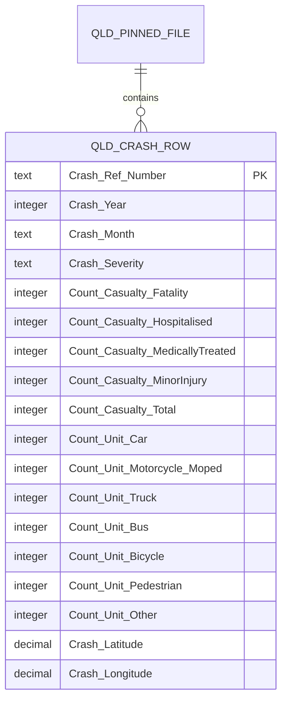

# D10 — Queensland source model and executed query evidence

## Delivery scope

This delivery models the pinned Queensland Road Crash Locations resource at its
native grain and records reproducible key, month, severity, count and location
queries. It uses the frozen `official_qld` contract and the successful official
build integrated at commit `562de2910bfd7be276b3036983e5680d436fde1e`.

| Item | Frozen value |
|---|---|
| Publisher | Queensland Department of Transport and Main Roads |
| Resource | `official_qld_crash` |
| Release scope | `qld_pinned_2020_2024_v1` |
| Native file SHA-256 | `975be4b02a235d06589de9b486f73bafe22d0f2007f0c07abb84f54cb926c704` |
| Native rows / columns | 415,407 / 52 |
| Reporting interval | occurrence years 2020–2024 |
| Successful official batch | `d6f0e958-7c94-4f2f-ba85-9d44e597cc02` |
| Query SQL | [`sql/d10_qld_source_evidence.sql`](../sql/d10_qld_source_evidence.sql) |
| Reproduction tool | [`tools/verify_d10_qld.py`](../tools/verify_d10_qld.py) |
| Result receipt | [`docs/evidence/d10-qld-source-query-2026-09-28.json`](evidence/d10-qld-source-query-2026-09-28.json) |

The original D01 investigation is retained at commit `b5395768d7242f4d42d5c78a7595babb6d9b1adf`.
B and C later froze the confirmed source contract used here. D10 does not rewrite
that source decision.

## Native model



The model has one native row per crash. `Crash_Ref_Number` is opaque text and is
scoped by source and release; `Crash_Year` supplies the occurrence year. The
seven `Count_Unit_*` values are aggregate attributes already stored on that
crash row. They do not identify individual vehicles, people or participants,
so D10 creates no Unit entity, Unit key, parent relationship or category fact.

The implemented pipeline keeps the same boundary:

1. B08 stores the complete native row in `raw.record.payload` with exact file lineage.
2. C05 projects one Canonical crash for each valid in-range native crash row.
3. D03 loads one crash fact per Canonical crash.
4. D05/D06 expose source-specific trend and severity results.
5. D08 returns QLD units as unavailable because this resource has no unit-detail rows.

## Actual results

The reproduction tool streamed the original CSV member from `raw.zip`, hashed
the original bytes and held only keys and counters. It did not modify or extract
the source. The SQL uses the same exact Raw identity and makes no permanent
database changes.

### Key and coverage

| Query result | Value |
|---|---:|
| Full native rows | 415,407 |
| Distinct nonblank `Crash_Ref_Number` values | 415,407 |
| Blank keys | 0 |
| Duplicate keys | 0 |
| Rows in 2020–2024 | 66,624 |
| Observed year/month groups | 60 |
| Rows with missing or unknown month | 0 |

| Year | Crash rows |
|---:|---:|
| 2020 | 12,147 |
| 2021 | 13,476 |
| 2022 | 13,021 |
| 2023 | 13,622 |
| 2024 | 14,358 |

The receipt contains all 60 monthly rows and five native key examples with CSV
row locators. No date is inferred from the crash identifier.

### Native severity and casualty counts

| Native severity | Crash rows |
|---|---:|
| Fatal | 1,304 |
| Hospitalisation | 31,922 |
| Medical treatment | 22,730 |
| Minor injury | 10,668 |
| Property damage only | 0 |
| Missing | 0 |

Fatalities total 1,424 and casualties total 88,609. All five casualty fields
are present, nonnegative integers in the analysis slice, and all four casualty
components reconcile to `Count_Casualty_Total`. These remain QLD native
definitions under `qld-native-severity-v1`; they are not pooled interstate KPIs.

### In-row unit-category aggregates

| Crash-row attribute | Sum of native values | Crash rows with a nonzero value |
|---|---:|---:|
| `Count_Unit_Car` | 102,555 | 60,895 |
| `Count_Unit_Motorcycle_Moped` | 8,227 | 8,022 |
| `Count_Unit_Truck` | 4,764 | 4,482 |
| `Count_Unit_Bus` | 938 | 934 |
| `Count_Unit_Bicycle` | 3,796 | 3,692 |
| `Count_Unit_Pedestrian` | 3,431 | 3,307 |
| `Count_Unit_Other` | 2,520 | 2,456 |

No unit-count value is missing, invalid or negative in the analysis slice.
These sums describe source columns only. They are not counts of identifiable
Unit rows and cannot be joined as parent/child records. The published official
batch correctly contains zero QLD `canonical.unit` rows and reports the unit
output as unavailable rather than as a measured zero-unit population.

### Location boundary

All 66,624 in-range native rows contain syntactically valid latitude/longitude
pairs in the declared source datum, GDA2020. This is source completeness, not
map eligibility. No independently validated GDA2020-to-EPSG:4326 operation is
frozen, so the successful official batch reports:

| Published result | Value |
|---|---:|
| Map status | unavailable |
| Eligible points | 0 |
| Unmapped crashes | 66,624 |
| QA07 | limited |

The coordinates must not be relabelled as EPSG:4326. A future map version needs
a versioned transformation and independent reference-point tests.

## Reproduction

From the repository worktree:

```powershell
python tools/verify_d10_qld.py `
  --archive "..\raw.zip" `
  --output docs/evidence/d10-qld-source-query-2026-09-28.json
```

Run `sql/d10_qld_source_evidence.sql` in `psql` against the installed official
database to reproduce the Raw-backed queries and the successful-batch boundary.
The SQL creates only a session-local temporary view, runs SELECT queries and
rolls the transaction back. It requires `TEMP` plus `SELECT` privileges and
makes no permanent database changes.

## Reporting limits

- Results apply only to the exact pinned file and occurrence years 2020–2024.
- The latest source records may be revised; a new file hash needs a new review.
- Property-damage-only reporting ended after 2010. Zero PDO rows in this slice
  does not mean zero real property-only crashes.
- Severity, fatality and casualty definitions remain source-specific.
- Official map and unit-detail outputs are unavailable.
- Final course presentation wording remains subject to the actual E01 team decision.
