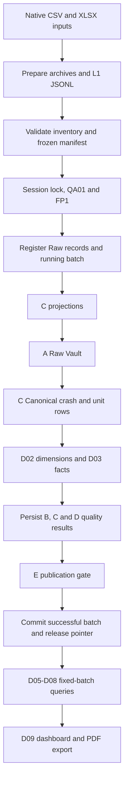

# ARSIA team onboarding

Start here if you have just joined the project. This guide explains what ARSIA
does, where to work, how data reaches the dashboard, and how to check a change.
Run commands from the repository root unless a step says otherwise.

## On this page

- [What we are building](#what-we-are-building)
- [Your first working session](#your-first-working-session)
- [Repository and workspace map](#repository-and-workspace-map)
- [How a build works](#how-a-build-works)
- [Quality rules and important terms](#quality-rules-and-important-terms)
- [Code walkthrough: D04 reconciliation](#code-walkthrough-d04-reconciliation)
- [Testing your work](#testing-your-work)
- [Making your first change](#making-your-first-change)
- [Troubleshooting](#troubleshooting)
- [Where to read next](#where-to-read-next)

## What we are building

ARSIA is a road-safety data pipeline and local reporting dashboard. It reads
CSV/XLSX sources, preserves their original records, converts state-specific
fields into a shared model, checks the results, and publishes a versioned batch
for analysis. The dashboard shows trends, severity, map points and traffic units,
and supports browser-based PDF export.

The project uses Python 3.12, PostgreSQL, packaged SQL and a small Python HTTP
dashboard with HTML/CSS/JavaScript. The supported Python range is
`>=3.12,<3.13`; the team Docker environment pins Python 3.12.6 and PostgreSQL
16.15. Use the supplied database environment for full builds: FP1 checks the
PostgreSQL version, so an arbitrary PostgreSQL 16 installation is not equivalent.

There are three useful input sets:

| Input | Purpose | Location |
|---|---|---|
| S0 | Small synthetic NSW/VIC/QLD business fixture for learning and regression tests | `tests/fixtures/s0/` |
| S8 | S0 extended with a synthetic SA source to test extensibility | `tests/fixtures/s8/`, `tests/fixtures/s8-bad-key/` |
| Official | Seven pinned original NSW/VIC/QLD files, with source-specific policies | `raw_datasource/`, `config/official-inputs-v1.json` |

The generated 19-row reader demo is another synthetic example; use S0 when
following the integrated business-build expectations. Synthetic examples do not
establish official-source acceptance. Official reports have explicit limits:
the current reader makes all official maps and VIC/QLD unit reports unavailable,
with reasons. See [official policy](d09-official-policy.md).

The team divides the work into roles; identifiers such as B10 and D04 refer to
deliverables within those roles, not execution order:

| Role | Responsibility | Main implementation |
|---|---|---|
| A / JJ | Database schema, permissions and Raw Vault loading | `sql/migrations/`, `arsia_ingest/vault_load.py` |
| B / Peixian | Input preparation, Raw loading, manifests, orchestration and recovery | `src/arsia_ingest/` |
| C / Serenity | State projections, Canonical model and C quality checks | `src/arsia_c/` |
| D / Yihua | Warehouse dimensions/facts, reconciliation and analysis queries | `src/arsia_d02/` through `src/arsia_d08/` |
| E / Aditya | FP1 fingerprint and publication gate | `sql/e/fp1.sql`, `arsia_ingest/publication*.py` |

Integration contributions cross these boundaries. The dashboard lives in
`src/arsia_d09/`; consult its [implementation record](d09-local-dashboard.md)
and Git history for attribution.

## Your first working session

### 1. Explore and run locally without a database

Open the repository root in your editor so `src/`, `tests/`, `config/`, `sql/`
and `docs/` are visible together. Select `.venv/bin/python` as the interpreter
after creating the environment. On macOS/Linux:

```sh
python3.12 -m venv .venv
source .venv/bin/activate
python -m pip install -r requirements-dev.txt
python -m pip install --no-build-isolation --no-deps -e .
python -m pytest -q tests/test_readers.py tests/test_runner.py
python -m arsia_ingest --config tests/fixtures/s0/config.json --output artifacts/onboarding-intake
python -m arsia_d09 --demo
```

On Windows, create the environment with `py -3.12 -m venv .venv` and activate
it using `.\.venv\Scripts\Activate.ps1`; the subsequent `python` commands are
the same. Docker-only setup is also available below.

The intake command prints a receipt with a `run_dir`. Check that directory's
`run.json` says `prepared`; `preparing` means incomplete. Preparation writes
archives and JSONL records but does not load a database or publish a batch.
`arsia-prepare` is the installed alias for this preparation command.

Open <http://127.0.0.1:8765/> to explore the demo dashboard. It uses illustrative
values without PostgreSQL. Stop the foreground server with Ctrl+C before
starting the Docker dashboard on the same port.

### 2. Build and read a real synthetic release

Use Git and Docker Desktop with Compose. The image requires a clean, committed
checkout; keep unfinished edits in your development checkout if using a separate
checkout for a replay. Follow the [team Docker guide](team-docker.md) for Windows
preparation commands and platform-specific details.

On macOS/Linux, create local settings once:

```sh
cp -n .env.example .env
mkdir -p artifacts/team artifacts/test-results
```

Edit `.env`: replace the placeholders, choose three different local passwords,
set `ARSIA_PROJECT` to your own project name, and set `ARSIA_EXECUTOR` to your
name. Set `ARSIA_REVISION` to the full output of `git rev-parse HEAD`. The default
host ports are 55432 for PostgreSQL and 8765 for the dashboard. Keep `.env` local.

Then, with Docker running:

```sh
sh docker/team/prepare-build.sh
export ARSIA_REVISION="$(git rev-parse HEAD)"
docker compose config --quiet
docker compose --profile tools build app
docker compose up -d --wait db
docker compose --profile tools run --rm app info
docker compose --profile tools run --rm app init
docker compose --profile tools run --rm app s0
docker compose --profile tools run --rm app status
docker compose --profile web up -d dashboard
```

`init` installs the schema and query functions into a fresh database; later calls
verify a recognized installation. `s0` prepares, builds and publishes S0. At
<http://localhost:8765/>, the published S0 baseline has 6 crashes, 6 units,
4 mapped crashes and 63 QA rows. Two crashes have permitted location limits.
A second identical `s0` run should return `no_change`.

For normal shutdown, use `docker compose --profile web --profile tools down`.
This keeps the daily database and archive volumes. Resume with
`docker compose --profile web up -d --wait`. Adding `--volumes` deletes the
environment's stored data; it is not part of normal shutdown.

Official inputs are optional for onboarding. They use Git LFS or a separately
supplied pinned input directory. Follow [official setup](team-docker.md#optional-official-build)
when you need them; keep the originals unchanged.

## Repository and workspace map

| Path | What to find or change here |
|---|---|
| `README.md`, `docs/` | Entry points, component guides, policies and validation records |
| `src/arsia_ingest/` | Intake CLI, readers, Raw/Vault loading, build recipes, runner, QA01/02, publication and recovery |
| `src/arsia_c/projections/` | NSW/VIC/QLD/SA adapters and dispatcher |
| `src/arsia_c/` | Canonical loading, Person/Node handling and QA03/04/05/07 |
| `src/arsia_d02/`, `src/arsia_d03/` | Warehouse dimensions and crash facts |
| `src/arsia_d04/` | QA06 Canonical-to-fact reconciliation |
| `src/arsia_d05/` through `src/arsia_d08/` | Trend, severity, map and unit query APIs, respectively |
| `src/arsia_d09/` | Dashboard composition, HTTP server, template, styles and report export script |
| `config/` | Input catalogues, contracts, mappings, policies, expected results and inventories |
| `sql/migrations/` | Ordered schema/permission migrations 001–011 |
| `sql/e/`, `src/*/sql/` | FP1 and packaged SQL used by installed components |
| `tests/`, `tests/fixtures/` | Regression tests, shared helpers and synthetic inputs |
| `tools/` | Input generators, inventory updater and isolated PostgreSQL verifiers |
| `docker/team/` | Image build, team CLI, provenance checks and imported A/E acceptance assets |
| `raw_datasource/` | Original input files managed with Git LFS |
| `artifacts/` | Ignored local outputs: preparation runs, build evidence and test reports |
| `docs/evidence/`, `docs/sources/evidence/`, `evidence/` | Checked-in receipts and evidence for particular historical runs |
| `pyproject.toml`, `requirements*.txt` | Packaging, CLI entry points, supported Python and dependency sets |

The editable Python installation reads your source changes. The Docker `app`
and `dashboard` use a wheel installed in the image: editing the host files or
restarting a container does not update that wheel. The optional `workspace`
service mounts the checkout for development commands, for example:

```sh
docker compose run --rm workspace -m pytest -q tests/test_runner.py
```

The workspace service uses the app image, so build that image first.

Keep these storage locations distinct:

| Environment | Storage | Purpose |
|---|---|---|
| Daily Compose project | `pgdata`, `appdata` volumes | Persistent database and prepared input archives |
| Host checkout | `artifacts/team/`, `artifacts/test-results/` | Command receipts and saved test reports |
| Acceptance Compose project | Separate `acceptance_pgdata` volume and network | Disposable test database whose rows can be cleared |

Use `ARSIA_PROJECT` to name your environment. Overriding both Compose files with
the same `-p` or `COMPOSE_PROJECT_NAME` defeats their project-name separation.
Older docs also link to `F/` and `Resources/`; those are external shared course
workspace folders and are not included in a standalone clone.

## How a build works



The diagram shows the successful build path. Start reading at
[`build.py`](../src/arsia_ingest/build.py): `s0_request()`, `s8_request()` and
`official_request()` construct the inputs to `runner.run_build()`.
[`components.py`](../src/arsia_ingest/components.py) binds the C/A/D callbacks;
`build_modules()` adds E's publication callback.

The runner owns a dedicated connection, session lock and transactions. It
commits Raw registration and the `running` batch separately, then executes the
projection-through-publication stages in one build transaction. Callbacks use
the supplied connection and context; they do not commit, roll back or close it.
Failure rolls back candidate build writes and preserves the previous published
release. Registered Raw input can remain for traceability.

If FP1 matches the current successful batch, the runner returns `no_change`
before registering a new batch. Concurrent builds can return `busy`. A lost
commit acknowledgement produces `unknown_commit`: retain the run evidence and
use [recovery](recovery.md) to inspect the original outcome before retrying.

The database layers serve different purposes:

| Schema | Purpose |
|---|---|
| `meta` | Source/resource registry, batches and current-release pointers |
| `raw` | Original record payloads and source locations |
| `rv` | Raw Vault hubs, satellites and crash–unit links |
| `canonical` | Shared crash and unit representation |
| `dw` | Analysis dimensions and crash facts |
| `qa` | Concrete checks and batch summaries |
| `published` | Reader-facing views of published data |

`arsia_owner` installs database objects, `arsia_loader` runs builds, and
`arsia_reader` reads permitted published results. D05–D08 read APIs receive a
successful batch ID. D09 pins one release for a displayed report so a newer
publication cannot mix batches within that report. PDF export prints the
displayed snapshot.

## Quality rules and important terms

The [QA contract](../config/qa-team-v1.1.json) defines seven groups:

| Rule | Producer | What it checks |
|---|---|---|
| QA01_INPUT | B | File identity, headers, source contracts and explained snapshot changes |
| QA02_RAW | B | Native-to-Raw counts, payloads and row locators |
| QA03_PROJECTED | C | Keys, types, dates, counts and relationships after projection |
| QA04_AUXILIARY | C | Unit/Person parents, declared counts and Node observations |
| QA05_SEMANTICS | C | Definitions, categories, missingness and eligibility |
| QA06_RECONCILIATION | D | Canonical/fact row equality, aggregates, lineage and definitions |
| QA07_LOCATION | C | Valid eligible points and explained unmapped crashes |

E checks the required concrete results as well as all seven summaries. Missing
checks are not passes. `limited` is permitted only for QA07: compliant location
gaps can exclude map points while retaining the crashes in other reports.
`block` prevents publication. SQL NULL, zero and an unavailable report have
different meanings and must stay distinct.

| Term | Meaning in this project |
|---|---|
| Resource | One declared input resource, such as a state's crash file |
| L1 record | Prepared row with `source_id`, `resource_id`, `file_sha256`, `parser_version`, `row_locator`, `payload` |
| Manifest | Frozen files, source definitions, mappings, rules and implementation identities for a build |
| Inventory | Reviewed code/schema paths and hashes; checked against actual files |
| FP1 | E's SQL fingerprint of frozen build inputs, used to identify an unchanged build |
| Batch | A database build attempt and its associated results |
| Release pointer | The current successful batch for a dataset kind; synthetic and official pointers are separate |
| Lineage | The link from a derived row back to the exact original resource, file and row |
| Receipt | A saved record of a command or validation run and its evidence |

## Code walkthrough: D04 reconciliation

To understand the reconciliation module, follow this route:

1. [`arsia_d04/__init__.py`](../src/arsia_d04/__init__.py) exposes `reconcile`,
   `runner_callback`, `RULE_ID` and `PRODUCER_VERSION` as the package API.
2. [`reconciliation.py`](../src/arsia_d04/reconciliation.py) reads the frozen
   source/year scope and compares Canonical crashes against warehouse facts.
   It checks keys, fields, NULLs, totals, lineage and definition versions.
3. `reconcile()` returns a `QAReport` containing each source-year check and a
   batch summary. Configured years with zero crashes still receive checks.
4. `runner_callback()` writes the report and summary evidence using the shared
   runner context. It leaves transaction control to B10.
5. E's publication gate evaluates QA06 together with the other six QA groups.

Begin with [`test_d04.py`](../tests/test_d04.py) for small cases: a passing
source-year, a zero-crash year, mismatched fields and invalid scope. Then read
[`test_d04_lineage_postgres.py`](../tests/test_d04_lineage_postgres.py) for actual
SQL behavior. An important regression changes lineage to the wrong row in the
same file: matching file hashes or aggregate totals alone must not make it pass.
The [D04 lineage guide](d04-lineage-review.md) explains the acceptance evidence.

## Testing your work

### Fast local checks

With the development environment active:

```sh
# Default suite; optional database checks may skip.
python -m pytest -q

# Reconciliation behavior and official-contract compatibility.
python -m pytest -q tests/test_d04.py tests/test_d04_official_contract.py

# Dashboard rendering, policy and saved-test-report behavior.
python -m pytest -q tests/test_d09.py tests/test_d09_official_policy.py tests/test_d09_test_results.py

# Discover the individual cases in a module.
python -m pytest --collect-only -q tests/test_d04.py
```

Some tests also verify inventory hashes. Intentional runtime or packaging
changes can require reviewed inventory updates before those checks pass.

Choose test files by the behavior you changed:

| Area | Representative tests and cases |
|---|---|
| Intake/Raw | `test_readers.py`, `test_pipeline.py`, `test_raw_load.py`: parsing, preparation and loading behavior |
| Manifest/build lifecycle | `test_manifest.py`, `test_runner.py`, `test_recovery.py`: frozen inputs, outcomes and recovery |
| C projections | `test_c03_nsw_projection.py`, `test_c04_vic_projection.py`, `test_s8_projection.py`: state mappings |
| C quality/location | `test_c07_node_location.py`, `test_s8_qa_expectations.py`, `test_c10_integration_postgres.py` |
| D warehouse/reconciliation | `test_d02.py`, `test_d03.py`, `test_d04.py` and their PostgreSQL counterparts |
| D reports/dashboard | `test_d05.py` through `test_d09.py`, `test_d09_official_policy.py` |
| E gate | `test_e_publication.py`, `test_e_gate_contract.py`, `test_e_postgres.py`: required evidence and gate faults |
| Whole build | `test_full_build_postgres.py`: real publication, no-change, invalid inputs, rollback, concurrency and lost-commit recovery |
| Docker packaging | `test_team_provenance.py`, `test_team_cli.py`, `test_team_acceptance.py`: image identity and CLI/acceptance guards |

### Database and installed-package acceptance

`requirements-db.txt` adds the PostgreSQL driver to the development dependencies.
Installing it does not configure or start a test database. PostgreSQL tests use
suite-specific opt-ins, DSNs and isolation guards; follow the relevant verifier
instead of pointing tests at your daily database.

For the standard Docker acceptance path, first build the app image from your
clean, reviewed checkout as described above, then run:

```sh
docker compose -f compose.acceptance.yaml up -d --wait acceptance-db
docker compose -f compose.acceptance.yaml run --rm acceptance
```

Inspect the new receipt, XML and logs under `artifacts/team/`, including failures
and skips. When finished, remove only that disposable environment:

```sh
docker compose -f compose.acceptance.yaml down --volumes --remove-orphans
```

This path exercises the installed wheel separately from editable-source tests.
For focused database work, use the commands and external virtual environment in
the [full-build guide](full-build-integration.md#reproduce),
[D04 lineage guide](d04-lineage-review.md) or
[dashboard acceptance guide](d09-local-dashboard.md). The `tools/verify_*`
scripts create isolated environments and save evidence. Official full-data
validation is a separate, larger run; it is not included in default acceptance.

### Save and inspect test results

```sh
mkdir -p artifacts/test-results
python -m pytest -q --junitxml=artifacts/test-results/latest.xml
```

Open the running dashboard's **Test results** page at
<http://localhost:8765/tests>. It reads the saved report; it does not execute
tests. A focused run's report describes only that selection. For PDF changes,
also inspect **Print / Save as PDF** in a browser; rendering tests do not prove
the final printed appearance.

Historical counts in the docs apply to their recorded commits and environments.
A passing default suite with skipped database cases is not full acceptance.

## Making your first change

1. Check `git status --short`, start from the team's tested `main`, and use your
   own task/member branch. Preserve existing work.
2. Locate the implementation, related contract/SQL, tests and component guide.
   Read the smallest relevant test cases before changing behavior.
3. Make the change and run focused tests. For database behavior, also use its
   isolated PostgreSQL verifier or acceptance path.
4. If reviewed runtime files changed, run
   `python tools/update_build_inventory.py`, then inspect `git diff -- config`.
   Inventories record approved bytes; refreshing hashes is not a substitute for
   reviewing the behavior. New runtime files may also need component registration.
5. Update relevant docs and record the actual commands, results and skips.
   Keep generated runs under `artifacts/`; add evidence to Git deliberately.
6. Review and commit the intended changes. To update an existing Docker
   dashboard, run `sh docker/team/rebuild-dashboard.sh` with the initialized
   database running. For a changed database/inventory baseline, follow the team
   guide's new-project workflow so the previous environment remains available.
7. Open a PR with the problem, changed behavior and validation. The repository's
   branch workflow uses merge commits and retains member/task branches for traceability.

Avoid editing imported files under `docker/team/vendor/` as a shortcut to fix
runtime code. Their source versions and hashes are recorded in
`docker/team/sources.json`; changes need the corresponding provenance review.

## Troubleshooting

| Symptom | Next step |
|---|---|
| Import error or unsupported Python | Select the Python 3.12 virtual environment and repeat the editable installation. |
| Many database tests skip | Read skip reasons (`pytest -ra`) and use the relevant verifier; installing the driver alone is insufficient. |
| Build says commit/restore changes | Inspect `git status --short`; prepare the image from a clean, committed checkout. |
| `MANIFEST_VERSION_CHANGED` or locked-file mismatch | Review the actual file change and affected inventories before refreshing hashes. |
| Git proof/revision mismatch | Rerun build preparation for the selected commit, or use the rebuild script for an existing dashboard. |
| Dashboard still shows old code | Rebuild the image; a container restart does not install source changes. |
| Port 8765 is occupied | Stop the local demo server or choose another `ARSIA_WEB_PORT`. |
| Dashboard has no published release | Run `app status`; ensure `app s0` succeeded in that same Compose project. |
| `busy` | Another build holds the shared session lock; inspect its status before retrying. |
| `unknown_commit` or `RECOVERY_REQUIRED` | Retain the inner run directory with `result.json` and follow the recovery guide before another build. |
| Official input hash/LFS error | Obtain the complete pinned originals; do not modify the catalogue to accept arbitrary files. |
| QA07 is `limited` or an official report is unavailable | Read the source/location evidence and policy; permitted missing coverage is part of the result. |

For dashboard startup failures:

```sh
docker compose --profile web logs --tail=100 dashboard
```

## Where to read next

| Goal | Documents |
|---|---|
| Run the shared environment | [Team Docker setup](team-docker.md), [dashboard guide](d09-local-dashboard.md) |
| Understand input contracts | [Native intake](native-intake.md), [S0](s0-inputs.md), [S8](s8-inputs.md) |
| Understand loading and orchestration | [Raw loading](raw-loading.md), [manifest](manifest.md), [runner](runner.md), [recovery](recovery.md) |
| Trace C/D quality and queries | [C/D integration](cd-integration.md), [joint QA](qa-joint-validation.md), [C10](c10-integration.md), [analysis queries](analysis-integration.md) |
| Understand publication | [FP1](e/e03-fp1.md), [QA completeness](e/e05-qa-completeness.md), [publication gate](e/e06-publication-gate.md) |
| Work with official data | [Official build](official-build.md), [source decisions](official-source-decisions.md), [VIC restrictions](vic-restricted-inputs.md) |
| Read delivered report examples | [D11 report package](d11-synthetic-report-package.md), `docs/reports/` |

Component guides often preserve the state at a particular delivery. For example,
older build receipts say D09 was deferred; later dashboard documentation records
its implementation and synthetic acceptance. Use each receipt's commit and scope
when interpreting it. `config/build-inventory.json` still sets
`final_platform: false`: integrated functionality and local test results do not
stand in for independent replay or final team acceptance.
