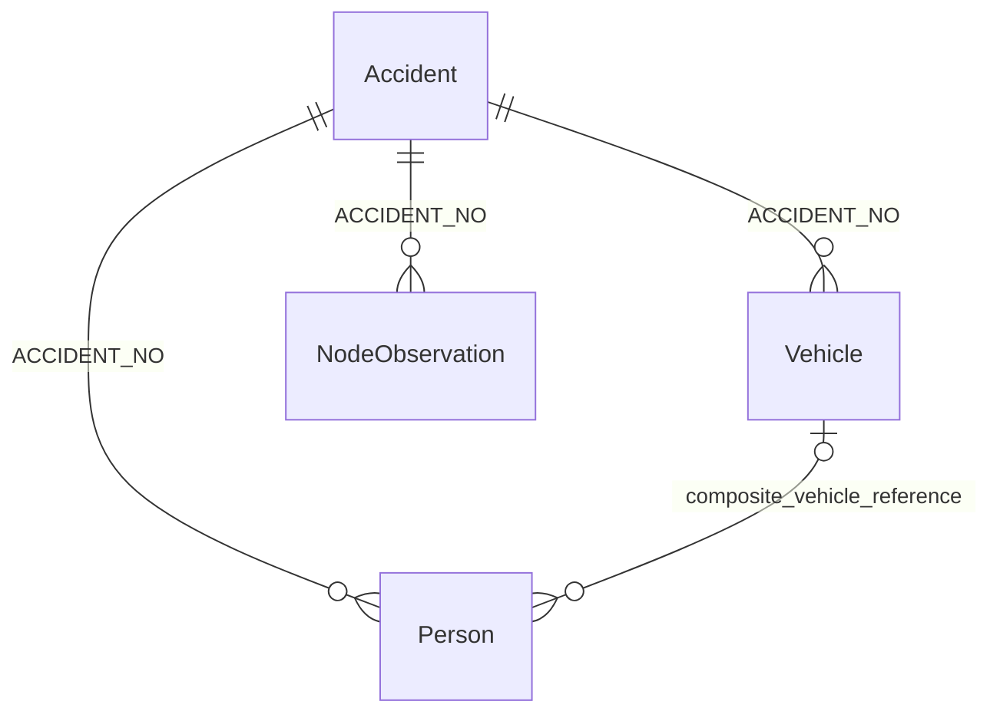

# C11: VIC source model and query evidence

Role C wrote the original model and queries in `d8d5863`, `46f3409` and
`a43a6b0`. Role B / Peixian added the missing checks and ran the complete
pinned snapshots on PostgreSQL 16.15. The base is `ad8baed`.

## Native model

| Resource | Native identity / grouping | Relationship |
| --- | --- | --- |
| Accident | `ACCIDENT_NO` | Parent crash |
| Vehicle | `ACCIDENT_NO, VEHICLE_ID` | Many vehicles per accident |
| Person | `ACCIDENT_NO, PERSON_ID` | Many people per accident; match a non-empty vehicle reference on both `ACCIDENT_NO` and `VEHICLE_ID` |
| Node | Group by `ACCIDENT_NO, NODE_ID` | Several physical observations may describe one location |

Node's group key is not a unique row key. Keep its observations in Raw. Raw
identity also includes the resource, file hash, parser version and native
locator. An empty Person vehicle reference is not automatically an orphan.



This diagram describes intended matching, not enforced source foreign keys.
The 39 unmatched non-empty references below remain visible.

## Actual replay: 25 September 2026

All four local originals matched `config/c06-vic-r1.json`. The receipt records
full file hashes, headers, row counts, parser versions and all migration hashes.
These queries cover the complete snapshots, including years outside 2020–2024.

| Query | Actual result |
| --- | --- |
| Q0: complete files and keys | Accident 200,352; Vehicle 365,470; Person 467,730; Node 405,918. Total 1,439,470. No blank native keys. No duplicate Accident, Vehicle or Person keys. |
| Q1: parent matching | 0 Vehicle, Person or Node rows without an Accident parent. |
| Q2: non-empty Person vehicle references | 39 unmatched full composite references. |
| Q2B: missing vehicle references | 18,776 empty; 0 SQL NULL; 0 whitespace-only. Of the empty references, 18,752 have the registered pedestrian/non-association pattern and 24 have another recorded pattern. |
| Q3A: identical Node payloads | 202,505 groups, with 202,505 extra physical rows. |
| Q3B: repeated Node group keys | 199,359 groups; 205,651 extra observations by group key. |
| Q3C: Node groups varying only in urban label | 3,137 groups containing 12,566 observations. |
| Q4: Node coordinates | 0 invalid-coordinate groups; 0 conflicting-coordinate groups; 200,267 groups with one coordinate pair. |
| Q5A/B: naive multi-join | Accident `T20160000627` has 21 vehicles, 28 people and 2 Node observations. The actual naive join returns 1,176 rows. Q5A lists the 50 largest examples. |
| Q5C: Person → Vehicle composite join | 467,730 people produce 467,730 joined rows, with 0 multiplied people. 448,915 match; 18,815 are unmatched or non-associated. |
| Q6: exact Accident → Node matching | 85 accidents lack an exact `ACCIDENT_NO, NODE_ID` match. |

The query file retains C's original Q1–Q5B queries. Q0, Q2B, Q5C and Q6 add
coverage, missing-reference, safe-join and missing-Node evidence. Full result
files are generated locally. Their row counts and SHA-256 hashes are in
[`c11-validation.json`](c11-validation.json); Raw data is not copied into this PR.

## Reproduce

Use Python 3.12, Docker, the four authorised local originals, and a clone that
contains A's fixed commit `c0824da06b6e7b3f73c4ddeab2114d10b7156913`.

```sh
python3.12 -m venv .venv
.venv/bin/pip install -r requirements-dev.txt 'psycopg[binary]==3.3.6'
PYTHONPATH=src .venv/bin/python tools/replay_c11_postgres.py \
  --raw-root /path/to/raw_datasource --a-repo /path/to/repository \
  --output /path/to/new-c11-results
```

The script creates a private PostgreSQL 16 container, applies A's 001–011
migrations, and keeps A03's original grants. B's native reader and B08 resource
registration feed a bulk COPY into empty Raw. This is a diagnostic replay, not
a B10 build or a test of B08's row-loading method. Queries run as `arsia_loader`.
All rows are rolled back, the original A03 audit runs before and after, and the
container is removed. The completed run left 0 Raw rows.

## Limits and review

The snapshot supports the model and observed counts above. Repeated Node rows
must not inflate crash counts. The safe composite Person join prevents
cross-accident matches, but does not resolve the 39 unmatched references.

Keep `vic-restricted-use-v1` in force: unresolved publisher permissions, source
scope and category definitions remain recorded; Person/Vehicle-derived public
KPIs and official maps are not enabled. These results do not approve publication
or complete platform acceptance. QA persistence is a separate C10 change.

C should review the added queries, interpretation of the registered cases and
replay receipt. E should use this model and evidence in E01's final presentation.
No new source files are needed for this replay.
